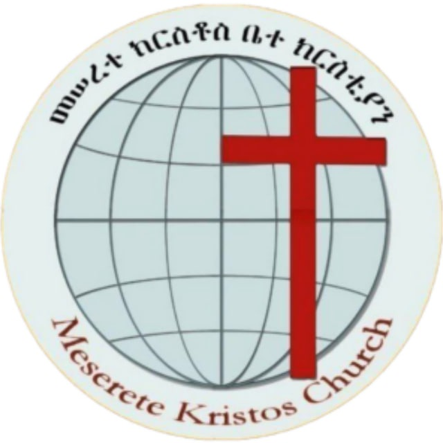

# NNMKC Digital Platform  
_A Modern Church Management and Digital Ministry System_

 

---

## 📖 Overview

The **North Nazareth Meserete Kristos Church (NNMKC) Digital Platform** is a full-stack, modern, scalable, and multilingual system designed to digitize church ministry operations, sermon management, announcements, donations, events, and counseling communication.

This platform is built with a focus on:
- Church growth  
- Digital transformation  
- Secure and organized leader operations  
- Smooth user experience for members worldwide  

The system is founded on the scripture:

> **“For no one can lay any foundation other than the one already laid, which is Jesus Christ.” — 1 Corinthians 3:11**

---

## ✨ Features

### **Public Side**
- Home page with scripture theme  
- Sermons (video, audio, and notes)  
- Announcements & church updates  
- Ministries & department pages  
- Events & program schedules  
- Online forms (baptism, membership, volunteering, prayer requests)  
- Online donation system (CHAPA Integration – ETB)  
- Multilingual support (Amharic, English, Afaan Oromo)

### **Admin / Leader CMS**
- Secure login (leaders-only access)  
- Role-based access control  
- Sermon upload & management  
- Announcement management  
- Ministry pages editor  
- Event editor  
- Form builder & responses viewer  
- Donation tracking  
- User management (add/remove leaders)

### **Future Enhancements**
- Secure WebRTC-based Chat & Call (Counseling Ministry)  
- AI-powered Bible study assistant (RAG + LLM)  
- AI ministry helper  
- Media auto-tagging  
- Mobile App (React Native)

---

## 🧰 Tech Stack

### **Frontend**
- React.js (TypeScript)  
- Vite  
- Chakra UI  
- React Query  
- Axios  
- Framer Motion  

### **Backend**
- NestJS (TypeScript)  
- PostgreSQL  
- Prisma ORM  
- JWT Authentication  
- Multer (for media uploads)  
- CHAPA Payment API  
- Docker  
- Jest (Testing)

---

## 🏛️ Architecture

- **Frontend:** SPA powered by React (TS)  
- **Backend:** Modular NestJS API  
- **Database:** PostgreSQL with Prisma  
- **Communication:** REST API  
- **State Management:** React Query  
- **Deployment:** Docker / Railway / Render / AWS  
- **Version Control:** GitHub  

---

## 📂 Project Structure (High-Level)

```

root/
├── backend/         # NestJS API
├── frontend/        # React + Vite App
├── docs/            # Documentation, diagrams, references
├── docker/          # Deployment configurations
├── .github/         # CI/CD workflows
├── README.md        # (This file)
└── package.json     # Workspace settings (optional)

````

---

## 🚀 Getting Started

### **1. Clone the Repository**
```bash
git clone https://github.com/YourOrg/NNMKC-Digital-Platform.git
cd NNMKC-Digital-Platform
````

---

## 🛠 Backend Setup (NestJS)

```bash
cd backend
npm install
cp .env.example .env
npm run prisma:generate
npm run start:dev
```

---

## 🎨 Frontend Setup (React + Vite)

```bash
cd frontend
npm install
npm run dev
```

---

## 💳 CHAPA Integration

1. Get your **Live** and **Test** keys from CHAPA Dashboard.
2. Add them to backend `.env`:

   ```
   CHAPA_PUBLIC_KEY=
   CHAPA_SECRET_KEY=
   ```
3. Donations will be handled through backend → frontend redirection pattern.

---

## 🔐 Authentication

* NestJS JWT strategy
* Access + Refresh tokens
* Role-based guards
* Admin can create leader accounts

---

## 🧪 Testing

```bash
npm run test
```

Backend uses Jest; frontend optional test setup can be added.

---

## 📌 Future Roadmap

* 🔒 Encrypted Chat + Call for Counseling Ministry
* 🤖 AI-powered Bible Study & Ministry Assistant
* 🌍 Multilingual Expansion
* 📱 Mobile App (React Native)
* 📊 Advanced Dashboard Analytics

---

## 🕊️ Acknowledgement

This project is dedicated to the ministry and growth of **North Nazareth Meserete Kristos Church**, built on the foundation of Jesus Christ.

---

## 📜 License

This project is licensed under **NNMKC Ministry Use License** (custom, to be defined). Not intended for commercial redistribution.

---

## 🙌 Contributors

* Pastoral Leadership
* Media Team
* Developers & Technical Team
* Donors & Partners

---
